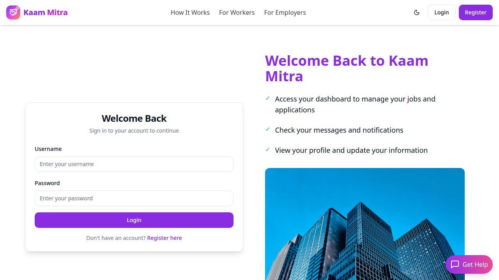
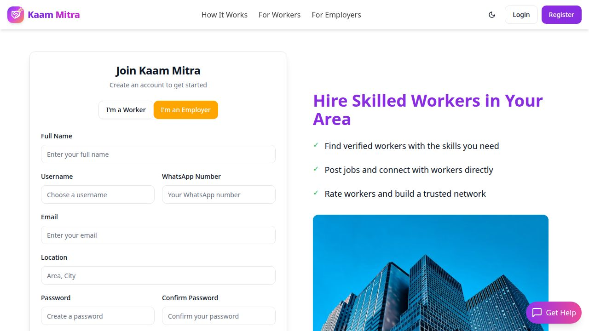
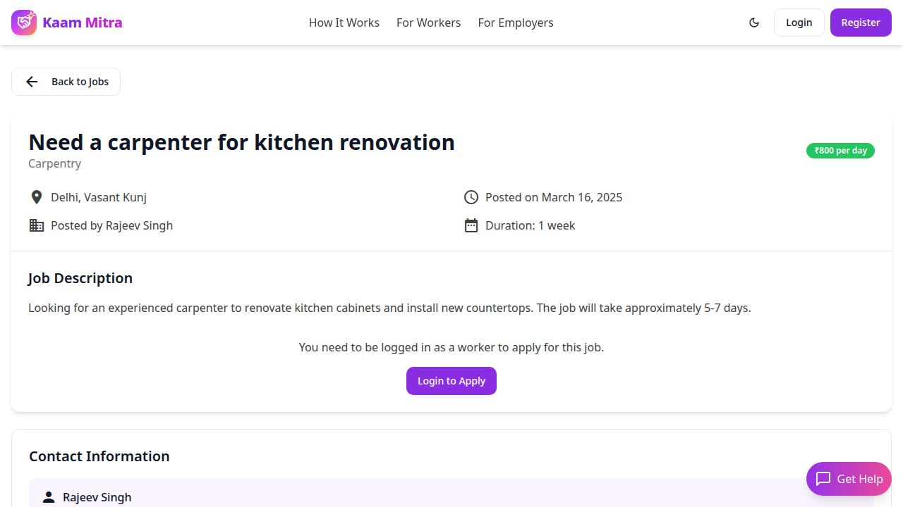

# Kaam Mitra

Kaam Mitra is a hyperlocal marketplace that connects skilled daily-wage workers with nearby employers. Workers can discover opportunities, apply for jobs, and build trusted profiles, while employers can post work, review applications, and connect directly with local talent.

## Product preview

| Home | Login |
| --- | --- |
|  |  |

| Employer registration | Job details |
| --- | --- |
|  |  |

## Features

- Location-based job discovery
- Separate worker and employer journeys
- Worker profiles with skills, availability, and ratings
- Employer job posting and application management
- Direct in-app conversations and unread-message tracking
- Government ID verification with private document access
- Email verification with retry-safe delivery diagnostics
- Saved jobs and favorite workers
- Role-based dashboards and protected routes
- Responsive React interface with light and dark themes

## Technology stack

- **Frontend:** React, TypeScript, Wouter, TanStack Query
- **Backend:** Node.js, Express, TypeScript
- **Database:** PostgreSQL with Drizzle ORM
- **Authentication:** Passport.js, express-session, PostgreSQL session store
- **Email:** Nodemailer
- **Uploads:** Multer and Replit Object Storage
- **UI:** Tailwind CSS, shadcn/ui, Radix UI

## Getting started

For the complete local setup, environment variables, database, and email configuration instructions, see [LOCAL_DEPLOYMENT.md](LOCAL_DEPLOYMENT.md).

### Quick start

```bash
npm install
npm run db:push
npm run dev
```

The development server runs on port `5000`.

### Useful commands

```bash
npm run check       # TypeScript validation
npm test            # Automated tests
npm run build       # Production build
npm run db:migrate  # Apply tracked migrations
npm run db:seed     # Seed development data
```

## Application routes

### Public

- `/` — landing page
- `/login` — sign in
- `/register` — worker or employer registration
- `/jobs/:id` — job details
- `/workers/:id` — worker profile

### Authenticated

- `/worker-dashboard` — worker dashboard
- `/employer-dashboard` — employer dashboard
- `/post-job` — create a job
- `/verification` — submit identity verification
- `/messaging` — conversations
- `/payment-demo` — payment workflow demo
- `/admin-dashboard` — administrator tools

## Project structure

```text
├── client/src/             # React application
│   ├── components/         # Reusable UI components
│   ├── hooks/              # Auth, messaging, and UI hooks
│   ├── pages/              # Routed pages
│   └── App.tsx             # Application router
├── server/                 # Express API and services
│   ├── auth.ts             # Registration, login, sessions, verification
│   ├── routes.ts           # Marketplace and protected API routes
│   ├── storage.ts          # Database access layer
│   └── index.ts            # Server entry point
├── shared/schema.ts        # Drizzle schema and validation schemas
├── migrations/             # Tracked database migrations
├── docs/screenshots/       # README preview images
└── package.json            # Scripts and dependencies
```

## Security and privacy

Identity documents are stored privately and are served only to the document owner or authorized administrators. Authentication, authorization, input validation, rate limiting, and session persistence are enforced on the server.

Never commit `.env` files, credentials, provider tokens, or private identity documents.

## Contributing

Contributions are welcome. Please open an issue to discuss a substantial change before submitting a pull request.

## License

This project is licensed under the MIT License. See [LICENSE](LICENSE) for details.